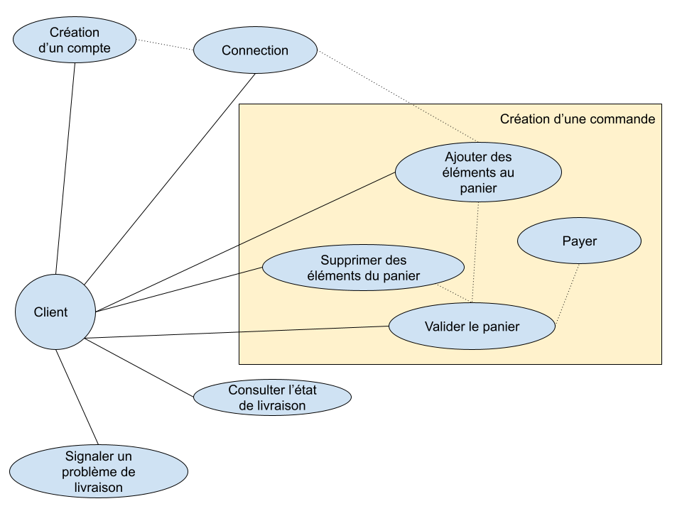
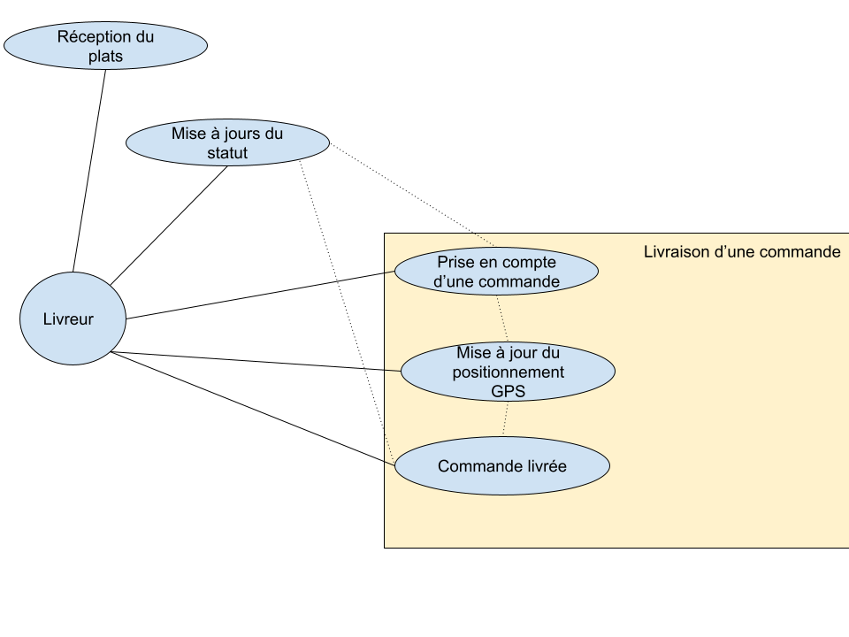
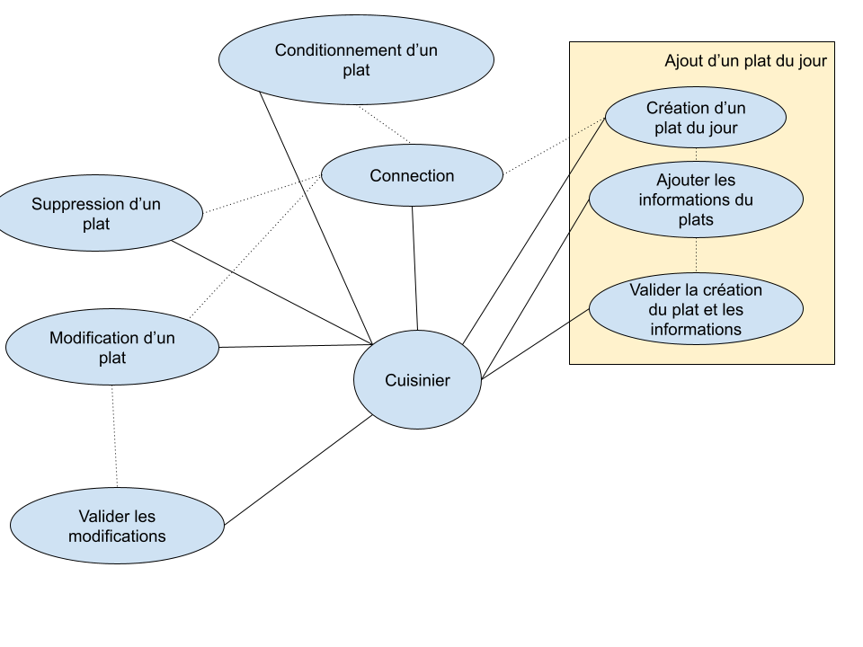
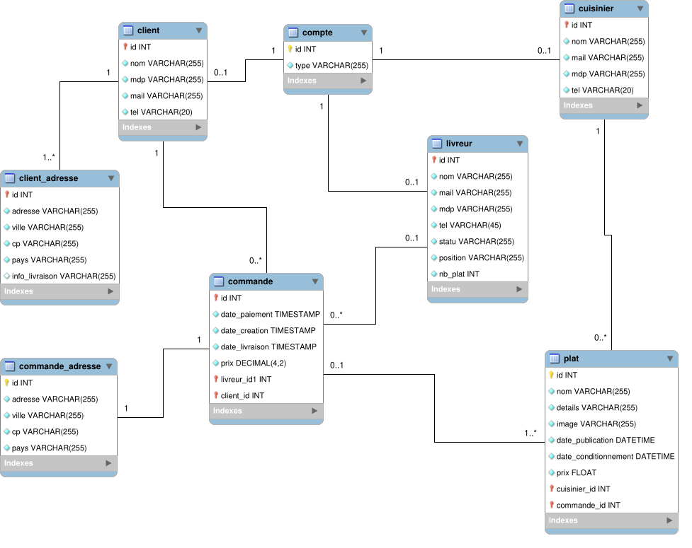

# Solution technique
## ExpressFood
___
# Sommaire
- Diagramme de cas d'utilisation
- Modèle de donnée
- Diagramme de classe
- Diagramme de séquences
- Schémas BDD
___
# Diagramme de cas d'utilisation
## Identifier les utilisateurs de l'applications
- Les clients
- Les livreurs
- Les cuisiniers

## Identifier les cas d'utilisation
- Clients
    - Consulter les plats
    - Payer
    - ...
- Livreurs
    - Accepter une course
    - Se géolocaliser
    - ...
- Cuisinier
    - Publier un plat
    - Modifier un plat
    - ...
## Ajouter les relations
___
## Ajouter un plat du jour

___
## Création d'une commande

___
## Livraison d'une commande

___
# Diagramme de classe

___

# FIN
